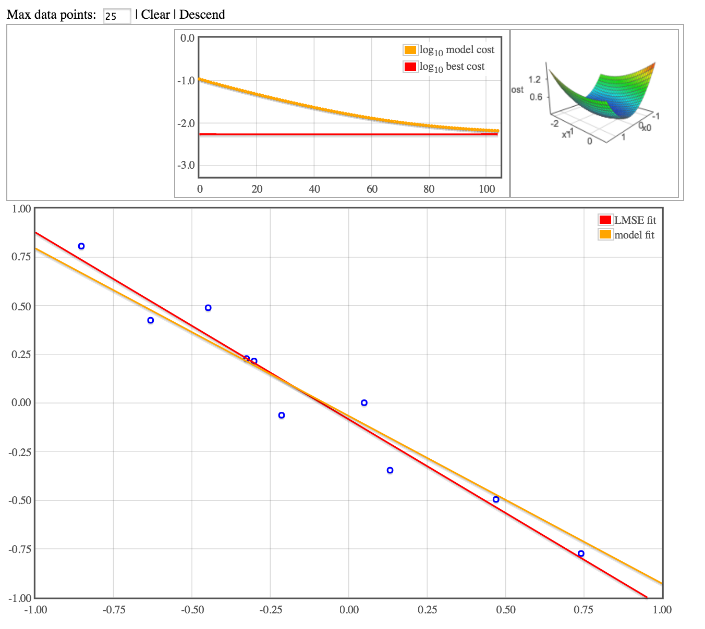

# Descend

Interactive machine learning demonstrations. A clickable graph allow you to input data. Use the controls buttons to begin a gradient descent algorithm (TODO: more fun things!). Visualie the current model fit alongside the best analytic fit, with stats such as model cost history and a graph displaying the cost for nearby parameter values.

See it live at [ozydingo.github.io/descend](http://ozydingo.github.io/descend)

Here's a screenshot:

## Models

 - Linear Regression (done)
 - Logistic regression & classification (todo)
 - Autoregressive model (todo)
 - Basic neural net (todo)

## TODO

 - Adjustible learning rate parameter.
 - Add non-linear terms (orders, sin).
 - Add trace to costscape to show history of model param estimates