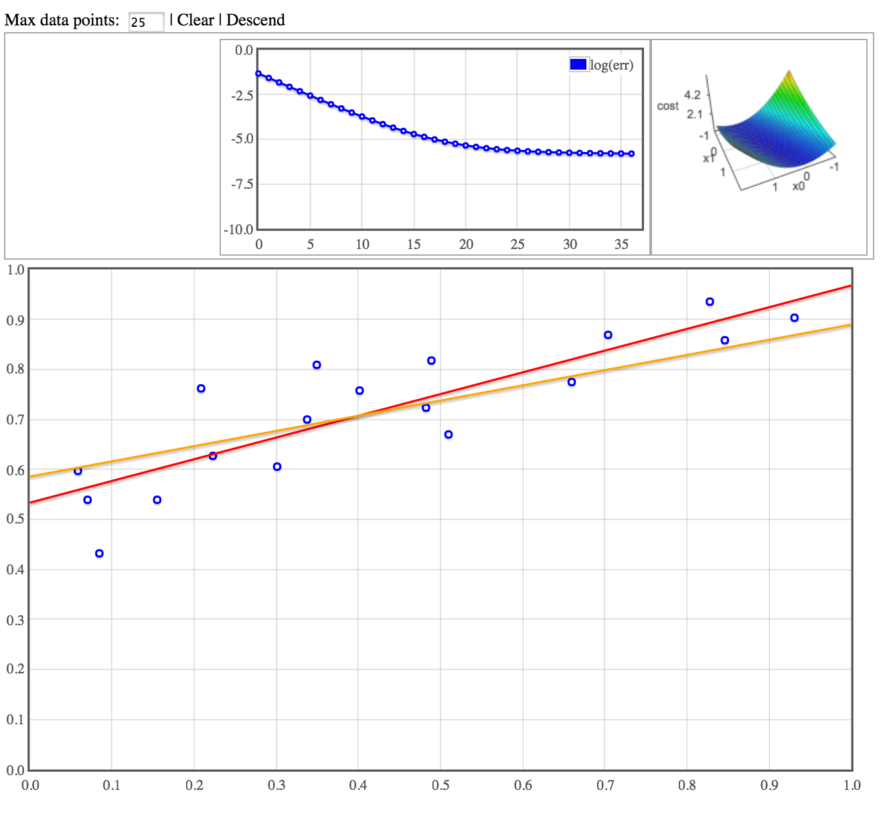

# Descend

Interactive machine learning demonstrations. Wedpage has a clickable graph and controls to begin a gradient descent algorithm (TODO: more fun things!) and visualize the current model and history of costs given existing model & data.

## Models

 - Linear Regression (done)
 - Logistic regression & classification (todo)
 - Autoregressive model (todo)
 - Basic neural net (todo)

## TODO

 - Adjustible learning rate parameter.
 - Add non-linear terms (orders, sin).
 - Add trace to costscape to show history of model param estimates